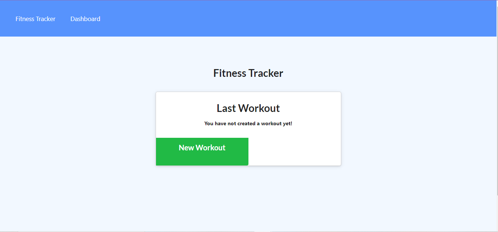
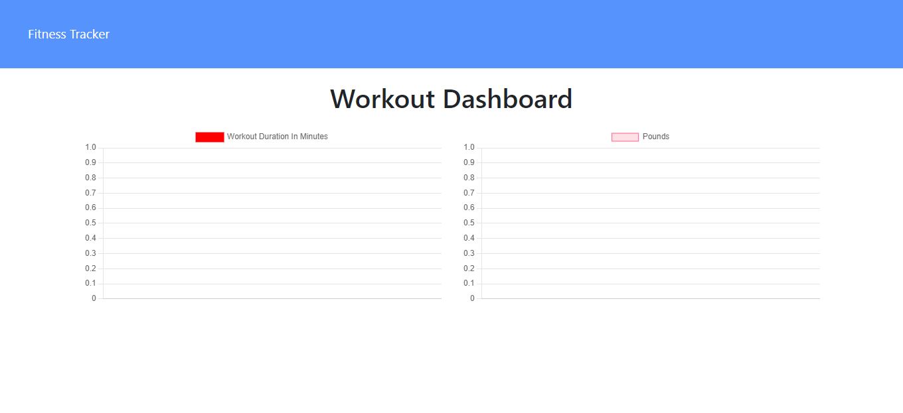
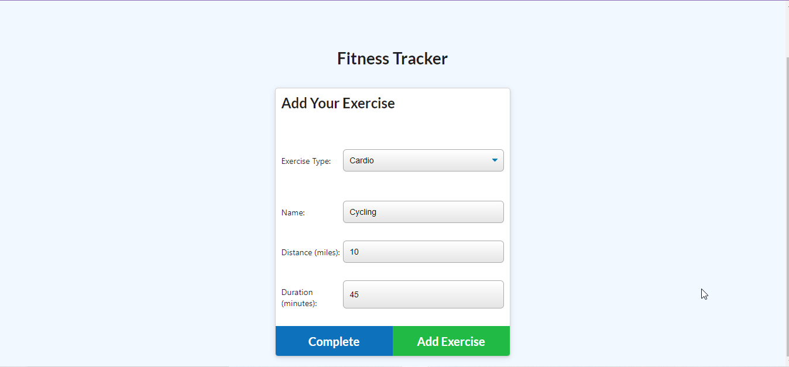

# workoutTracker

## Description
--------------
Front-end Fitness Tracker that connects with Mongo DB with a Mongoose Schema and launches with Heroku
## Table of Contents
--------------------

* Goals
* Usage
* Installation
* Visualization
* License
* Contact

## Goals
--------
* User can add an exercises based on cardio options and resistance options. 
* Data is added as entries are completed to the database
* User is given options to create their database of tracking with weight, reps, sets, distance, and time.
* User can follow up on past progress with a stats page.

## Usage
-------
Fitness Tracker for Cardio and Resistance Training

## Installation
---------------
* Install: npm i
* Seeding: node seers/seed.js
* Connects to Server with node server.js

## Visualization
----------------

## License
-----------
Copyright 2021 Meredith Coyne

Permission is hereby granted, free of charge, to any person obtaining a copy of this software and associated documentation files (the "Software"), to deal in the Software without restriction, including without limitation the rights to use, copy, modify, merge, publish, distribute, sublicense, and/or sell copies of the Software, and to permit persons to whom the Software is furnished to do so, subject to the following conditions:

The above copyright notice and this permission notice shall be included in all copies or substantial portions of the Software.

THE SOFTWARE IS PROVIDED "AS IS", WITHOUT WARRANTY OF ANY KIND, EXPRESS OR IMPLIED, INCLUDING BUT NOT LIMITED TO THE WARRANTIES OF MERCHANTABILITY, FITNESS FOR A PARTICULAR PURPOSE AND NONINFRINGEMENT. IN NO EVENT SHALL THE AUTHORS OR COPYRIGHT HOLDERS BE LIABLE FOR ANY CLAIM, DAMAGES OR OTHER LIABILITY, WHETHER IN AN ACTION OF CONTRACT, TORT OR OTHERWISE, ARISING FROM, OUT OF OR IN CONNECTION WITH THE SOFTWARE OR THE USE OR OTHER DEALINGS IN THE SOFTWARE.

## Contact
----------

[Github Fitness Tracker Repository](https://github.com/meredithcoyne/workoutTracker)

Email: meredithleigh.coyne@gmail.com

[Deployed Fitness Tracker Page](https://intense-hollows-42979.herokuapp.com/)

